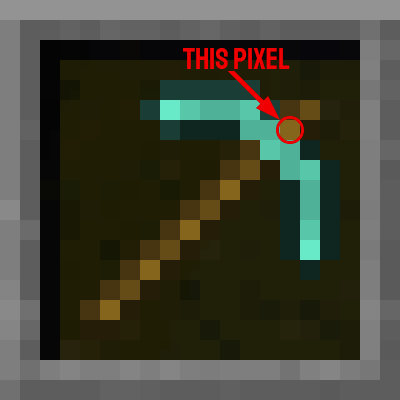

# InfiniMiner
A python script that allows to go AFK on Minecraft, letting your character mining on the same block until he breaks all
the pickaxes in his toolbar (9)\
This project is a fork from a base project made by [BigMushFrog23](https://github.com/BigMushFrog23)

# How to use
1. Download the main.py file
2. Install the required dependencies
3. Fill in your minecraft inventory with as much pickaxe from the same type as possible
4. [Configure](#configuration) the program correctly
5. Run the program (double-click on it / `python main.py`)
6. Switch to your Minecraft tab (the game must **NOT** be in full screen)
7. Watch the block you want to break
8. Press `x`
9. Press `x` again to stop the program or wait for it to stop manually (when no more pickaxes are left)

## Configuration
### Pixels location
#### SLOT_X and SLOT_Y
The coordinates of scanned pixel for the first slot (see the image)\
\
Default value: 809, 1011 (for 1920x1080 screen with GUI scale set to 2)
#### SLOT_WIDTH
The distance in pixels between two slots of the hotbar\
Default value: 40 (for 1920x1080 screen with GUI scale set to 2)

### Hotkeys
Change the `HOTKEYS` array in main.py depending on your keyboard configuration
- For AZERTY, use `["&", "é", "\"", "'", "(", "-", "è", "_", "ç", "à"]`
- For QWERTY, use `["0", "1", "2", "3", "4", "5", "6", "7", "8", "9"]`

Those are for minecraft default key bindings, change them accordingly to your game configuration